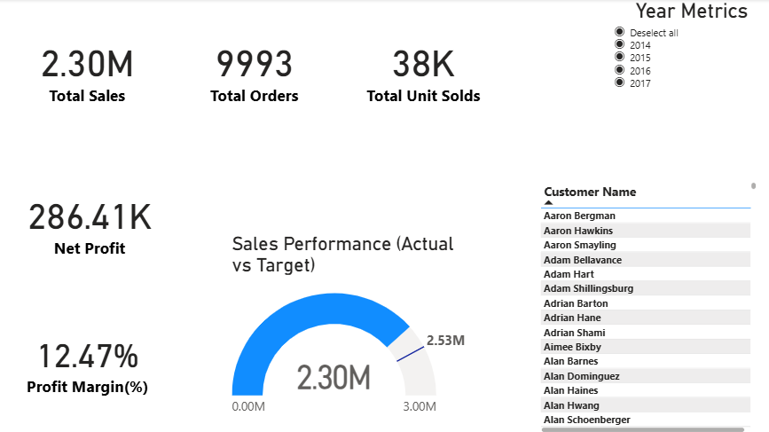
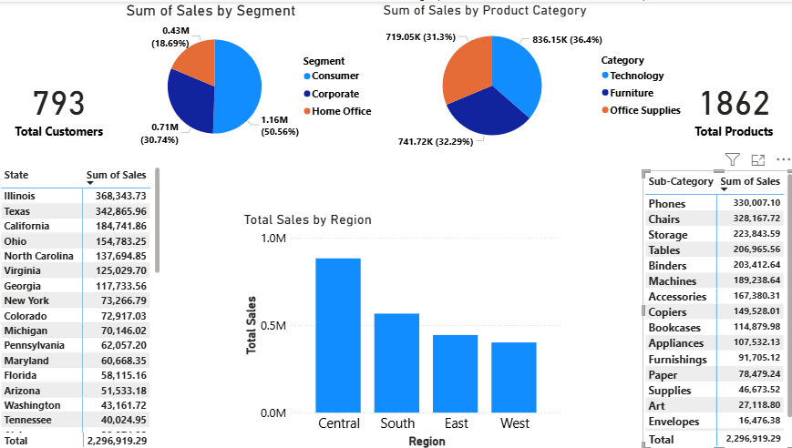
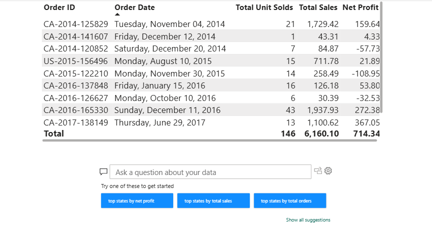

# Power BI Superstore Sales Dashboard

## 📊 Project Overview
An end-to-end **Sales Analytics Dashboard** built using **SQL Server** and **Power BI**.  
The project focuses on data modeling, KPI analysis, time trends, and customer-level insights to support business decision-making.

---

## 🛠 Tools & Technologies
- SQL Server (ETL, data cleaning, star schema)
- Power BI Desktop
- DAX (Measures, Calculated Columns)

---

## 📌 Dashboard Highlights
- **Executive KPIs**: Sales, Profit, Profit Margin, Orders, Units Sold
- **Target vs Actual Sales** performance (Gauge)
- **Customer & Product Analysis** by Region, Segment, Category
- **Time-based Trends** (Year, Quarter, Month, Weekday)
- **Metric Slicer** (Switch between Sales, Profit and Unit Sold across visuals)
- **Drill-through** customer-level order details

---

## 🧩 Data Model
- Fact Table: Orders
- Dimension Tables: Customers, Products
- Star schema design for optimized analysis

---

## 🎯 Use Case
Designed for:
- Business performance tracking
- Sales and customer insights
- Demonstrating Power BI & SQL skills for job applications

---

## 👤 Author

**Jagdish Sharma**  
📧 **Email:** jagdishsharma464347@gmail.com  
📍 **Location:** India  

---

## 📸 Dashboard Preview

Below are static preview images of the Power BI dashboard pages:

---

### 📝 Note
**For full interactivity**, download the `.pbix` file and open it in **Power BI Desktop** to explore slicers, filters, drill-through pages, and customer-level details.  
**For a quick visual overview**, refer to the dashboard screenshots provided in the **Dashboard Preview** section above.
